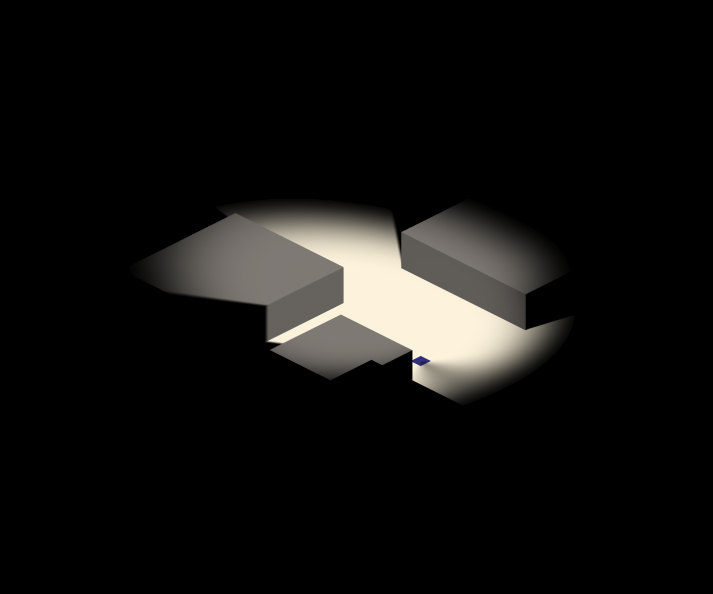
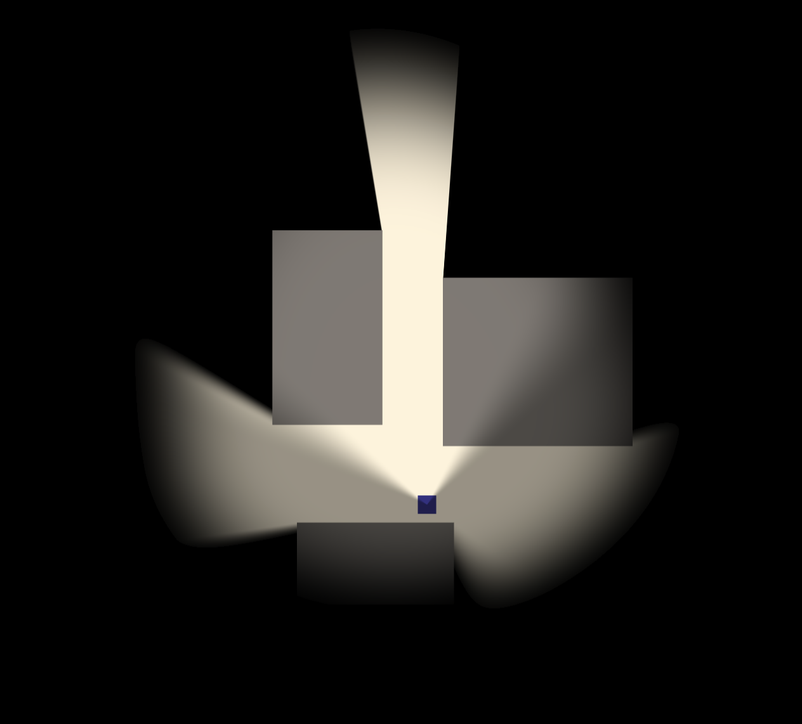

A small light in a large dark. WebGL2, no dependencies.

[live](https://liminal-dwsw5.ondigitalocean.app/)

## move

- `wasd` — walk
- `mouse` — aim
- `click` — shift perspective
- `l` — light



## render

One fragment shader. Cone light with oval falloff, radial ambient glow, soft AABB shadows (up to 24 occluders), per-face backface darkening, and a flicker model that bursts then rests. All geometry comes from two unit VAOs — a floor quad and a wall quad — transformed by uniforms. Depth test with a three-pass draw order (below player, player, above player) keeps towers layered through the semi-transparent floors.

World streams in 400-unit procedural chunks, seeded per coordinate. No textures, no images, no shader libraries. TypeScript, WebGL2, Vite. ~170 lines of GLSL.

## run

```
npm install
npm run dev
```
